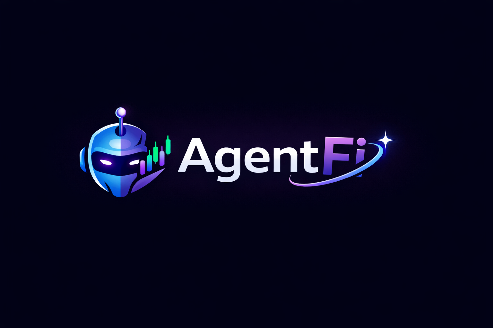
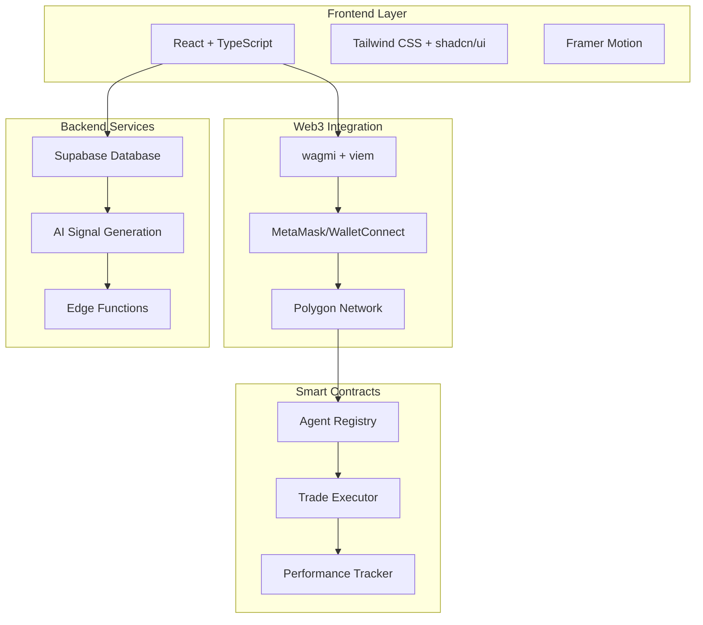

# 🤖 AgentFi - Autonomous AI Trading Agents on Polygon

<div align="center">
  
  
  **Deploy intelligent AI agents that analyze crypto markets and execute DeFi strategies transparently on-chain**
  
  [](https://reactjs.org/)
  [](https://polygon.technology/)
  [](https://www.typescriptlang.org/)
  [](https://tailwindcss.com/)
</div>

---

## 🌟 Overview

AgentFi is a cutting-edge DeFi platform that enables users to deploy autonomous AI trading agents on the Polygon blockchain. These intelligent agents analyze market trends, generate trading signals, and execute strategies transparently on-chain, providing a new paradigm for decentralized finance.

### 🎯 Key Features

- **🧠 AI-Powered Intelligence**: Advanced ML models analyze market trends and generate trading signals
- **⛓️ On-Chain Execution**: Transparent, verifiable trades executed via smart contracts
- **📊 Real-Time Analytics**: Live performance tracking with detailed P&L calculations
- **🛡️ Risk Management**: Configurable risk levels and emergency stop mechanisms
- **🎨 Modern UI/UX**: Crypto-native design with glassmorphism and neon aesthetics

---

## 🏗️ Architecture



---

## 📱 Application Structure

### 🗂️ Core Pages (5 Pages Total)

```
📄 Landing Page (/)
├── Hero Section with value proposition
├── Feature cards and benefits
├── How it works explanation
└── Call-to-action buttons

📊 Dashboard (/dashboard)
├── Portfolio overview and P&L
├── Active agents grid
├── Performance statistics
└── Quick actions

🤖 Create Agent (/create-agent)
├── Agent configuration form
├── Strategy selection
├── Risk level settings
└── Deployment interface

📈 Agent Details (/agent/:id)
├── Individual agent performance
├── Trade history and analytics
├── Strategy configuration
└── Control panel

⚙️ Settings (/settings)
├── Wallet information
├── API configuration
├── Notification preferences
└── Trading preferences
```

### 🎨 Design System

```
🎨 Color Palette
├── Primary: hsl(265 89% 66%) - Neon Purple
├── Accent: hsl(172 66% 50%) - Neon Cyan
├── Success: hsl(142 76% 54%) - Neon Green
├── Warning: hsl(25 95% 53%) - Neon Orange
└── Danger: hsl(330 81% 60%) - Neon Pink

🔤 Typography
├── Primary: Bitcount Single (Futuristic)
├── Monospace: Bitcount Prop Single
└── Fallback: Inter, system-ui

✨ Effects
├── Glassmorphism cards
├── Gradient text and borders
├── Neon glow effects
└── Smooth animations
```

---

## 🚀 Getting Started

### 📋 Prerequisites

- **Node.js** 18+ and npm
- **MetaMask** or compatible Web3 wallet
- **Polygon** network access

### 🛠️ Installation

1. **Clone the repository**
   ```bash
   git clone <YOUR_GIT_URL>
   cd agentfi-smart-defi-intelligence
   ```

2. **Install dependencies**
   ```bash
   npm install
   ```

3. **Start development server**
   ```bash
   npm run dev
   ```

4. **Open in browser**
   ```
   http://localhost:5173
   ```

### 🔧 Available Scripts

```bash
npm run dev          # Start development server
npm run build        # Build for production
npm run build:dev    # Build for development
npm run preview      # Preview production build
npm run lint         # Run ESLint
npm run test         # Run tests
npm run test:watch   # Run tests in watch mode
```

---

## 🏛️ Project Structure

```
agentfi-smart-defi-intelligence/
├── 📁 public/
│   ├── logo.png                 # AgentFi logo
│   ├── favicon.ico             # Browser favicon
│   └── robots.txt              # SEO configuration
├── 📁 src/
│   ├── 📁 components/
│   │   ├── 📁 ui/              # Reusable UI components
│   │   ├── 📁 landing/         # Landing page sections
│   │   ├── Navbar.tsx          # Navigation component
│   │   ├── Footer.tsx          # Footer component
│   │   └── WalletProvider.tsx  # Web3 wallet integration
│   ├── 📁 pages/
│   │   ├── Index.tsx           # Landing page
│   │   ├── Dashboard.tsx       # Main dashboard
│   │   ├── CreateAgent.tsx     # Agent creation
│   │   ├── AgentDetails.tsx    # Agent details view
│   │   ├── Settings.tsx        # User settings
│   │   └── NotFound.tsx        # 404 page
│   ├── 📁 lib/
│   │   └── utils.ts            # Utility functions
│   ├── App.tsx                 # Main app component
│   ├── main.tsx               # App entry point
│   └── index.css              # Global styles
├── 📄 package.json            # Dependencies and scripts
├── 📄 tailwind.config.ts      # Tailwind configuration
├── 📄 tsconfig.json          # TypeScript configuration
└── 📄 vite.config.ts         # Vite build configuration
```

---

## 🔗 Technology Stack

### 🎨 Frontend
- **React 18** - Modern UI library with hooks
- **TypeScript** - Type-safe JavaScript
- **Vite** - Fast build tool and dev server
- **Tailwind CSS** - Utility-first CSS framework
- **shadcn/ui** - High-quality component library
- **Framer Motion** - Smooth animations and transitions

### 🌐 Web3 Integration
- **wagmi** - React hooks for Ethereum
- **viem** - TypeScript interface for Ethereum
- **Polygon** - Layer 2 scaling solution

### 🗄️ Backend & Data
- **Supabase** - Backend-as-a-Service
- **Edge Functions** - Serverless API endpoints
- **PostgreSQL** - Relational database

### 🎯 Development Tools
- **ESLint** - Code linting and formatting
- **Vitest** - Unit testing framework
- **TypeScript** - Static type checking

---

## 🔮 Roadmap

### 📅 Phase 1: Foundation (Weeks 1-2) ✅
- [x] Landing page with wallet integration
- [x] Core page structure (5 pages)
- [x] UI/UX design system implementation
- [x] Responsive design and animations

### 📅 Phase 2: Smart Contracts (Weeks 3-4)
- [ ] Agent Registry contract deployment
- [ ] Trade Executor contract with DEX integration
- [ ] Performance Tracker for on-chain metrics
- [ ] Contract integration with frontend

### 📅 Phase 3: AI Backend (Weeks 5-6)
- [ ] Market analysis AI system
- [ ] Signal generation algorithms
- [ ] Real-time data feeds integration
- [ ] Performance optimization

### 📅 Phase 4: Advanced Features (Weeks 7-8)
- [ ] Advanced analytics dashboard
- [ ] Social features and leaderboards
- [ ] Mobile app development
- [ ] Security audits and testing

---

## 🤝 Contributing

We welcome contributions to AgentFi! Please follow these steps:

1. **Fork the repository**
2. **Create a feature branch** (`git checkout -b feature/amazing-feature`)
3. **Commit your changes** (`git commit -m 'Add amazing feature'`)
4. **Push to the branch** (`git push origin feature/amazing-feature`)
5. **Open a Pull Request**

### 📝 Development Guidelines
- Follow TypeScript best practices
- Use conventional commit messages
- Ensure responsive design compatibility
- Add tests for new features
- Update documentation as needed

---

## 📄 License

This project is licensed under the MIT License - see the [LICENSE](LICENSE) file for details.

---

## 🆘 Support

- **Documentation**: [Coming Soon]
- **Discord**: [Join our community]
- **Twitter**: [@AgentFi]
- **Email**: support@agentfi.io

---

<div align="center">
  <p>Powered by Polygon • Secured by AI • Driven by Innovation</p>
</div>
